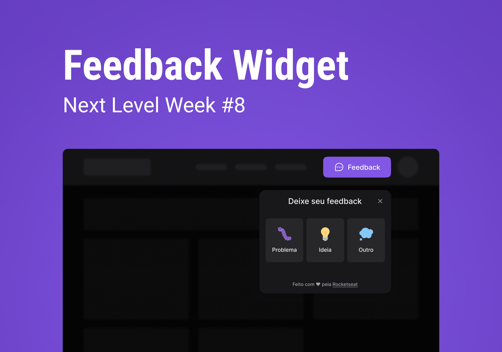

<h1 align="center">
  Feedback Widget
</h1>

<div>
  
</div>

<p align="center">
  Projeto desenvolvido durante a 8º edição do evento NLW feito pela <a href="https://www.rocketseat.com.br/">Rocketseat</a>
</p>

<p align="center">
 <a href="#sobre">Sobre o Projeto</a> •
 <a href="#funcionalidades">Funcionalidades</a> • 
 <a href="#pre-requisitos">Pré-requisitos</a> • 
 <a href="#como-executar">Como executar</a> • 
 <a href="#tecnologias">Tecnologias</a> • 
 <a href="#autor">Autor</a> • 
 <a href="#licenca">Licença</a> • 
</p>

<h4 align="center"> 
	🚧  Projeto 🚀 Em construção...  🚧
</h4>

---

<div>
  
</div>

<h2 id="sobre">💻️ Sobre o projeto</h2>
A aplicação é constituida tanto do front-end, quanto do back-end, o deploy do front-end foi feito na vercel e o back-end na railway. <a href="https://nlw-return-impulse-ten-woad.vercel.app/">Clique aqui</a> para acessar a demonstração do projeto

###  Front-end
Temos um widget de feedback que pode ser colocado em outros projetos, nele podemos selecionar qual tipo de feedback queremos enviar, escrever um comentário, tirar uma screenshot da tela e enviar esse feedback para o back-end

### Back-end
O back-end realiza o armazenamento dos feedbacks enviados usando o postgreSQL como banco de dados, faz o envio de emails para o administrador da aplicação acompanhar o envio de feedbacks além de tratar todas as regras de negócio.

Um dos back-ends mais bem feitos que já fiz, usamos o princípio SOLID junto com testes unitários para tornar a aplicação mais robusta possível

---

<h2 id="funcionalidades">⚙️ Funcionalidades</h2>

- [ ] Front-end
  - [x] Widget de feedback totalmente funcional
  - [ ] Tema Light/Dark
  - [ ] Dasboard para administração dos feedbacks
  - [ ] Validação de campos e erros
- [ ] Back-end
  - [X] Cadastro de feedbacks no banco
  - [X] Aplicação de testes unitários
  - [X] Envio de emails para o mailtrap
  - [ ] Envio de emails reais usando algum serviço no ambiente de produção
  - [ ] Melhorar HTML/CSS do Email
  - [ ] Autenticação com Firebase


---

<h2 id="pre-requisitos">🟢 Pré-requisitos</h2>

Antes de começar, você vai precisar ter instalado em sua máquina as seguintes ferramentas:
[Git](https://git-scm.com), [Node.js](https://nodejs.org/en/), [Docker](https://www.docker.com/) com uma imagem do postgreSQL instalada. 
Além disto é bom ter um editor para trabalhar com o código como [VSCode](https://code.visualstudio.com/)

<h2 id="como-executar">🚀 Como Executar o projeto</h2>

### Front-end

```bash
# Clone este repositório
$ git clone git@github.com:jose-uilton-ferreira/nlw-return-impulse.git

# Acesse a pasta do projeto no terminal/cmd
$ cd nlw-return-impulse

# Vá para a pasta web
$ cd web

# Instale as dependências
$ npm install

# Execute a aplicação em modo de desenvolvimento
$ npm run dev

# O servidor inciará na porta:3000 - acesse <http://localhost:3000>
```

Crie o arquivo ```".env.local"``` e coloque como valor na variável ```"VITE_API_URL"``` a URL onde estará rodando o back-end do projeto

### Back-end
```bash
# Clone este repositório
$ git clone git@github.com:jose-uilton-ferreira/nlw-return-impulse.git

# Acesse a pasta do projeto no terminal/cmd
$ cd nlw-return-impulse

# Vá para a pasta server
$ cd server

# Instale as dependências
$ npm install

# Crie o arquivo .env e coloque como valor na variável DATABASE_URL a URL do banco de dados posgreSQL que está rodando no docker

# Execute as migrations do prisma
npx prisma migrate dev

# Execute a aplicação em modo de desenvolvimento
$ npm run dev

# O servidor inciará na porta:3333 - acesse <http://localhost:3333>
```

---

<h2 id="tecnologias">🛠 Tecnologias</h2>

As seguintes ferramentas foram usadas na construção do projeto:

### Front-end
- [React](https://pt-br.reactjs.org/)
- [TailwindCSS](https://tailwindcss.com/)
- [HeadlessUI](https://headlessui.dev/)
- [Typescript](https://www.typescriptlang.org/)
- [Vite](https://vitejs.dev/)


### Back-end

- [Node.js](https://nodejs.org/en/)
- [Express](https://expressjs.com/pt-br/)
- [TypeScript](https://www.typescriptlang.org/)
- [Prisma](https://www.prisma.io/)
- [PostgreSQL](https://www.postgresql.org/)
- [Jest](https://jestjs.io/pt-BR/)
- [Nodemailer](https://nodemailer.com/about/)

---

<h2 id="autor">🦸 Autor</h2>

<a href="https://www.linkedin.com/in/jos%C3%A9-uilton-ferreira-de-siqueira-399158198/">
 
 <br />
 <sub><b>José Uilton</b></sub>
 </a>


Feito com ❤️ por José Uilton 👋 Entre em contato!

[](https://twitter.com/UiltonSiqueira) [](https://www.linkedin.com/in/jos%C3%A9-uilton-ferreira-de-siqueira-399158198/) 
[](mailto:programasuilton@gmail.com)

---

<h2 id="licenca">📝 Licença</h2>
Este projeto foi feito sobe a licença <a href="https://github.com/jose-uilton-ferreira/desafio02-trilha-reactjs/blob/main/LICENSE">MIT</a>.

